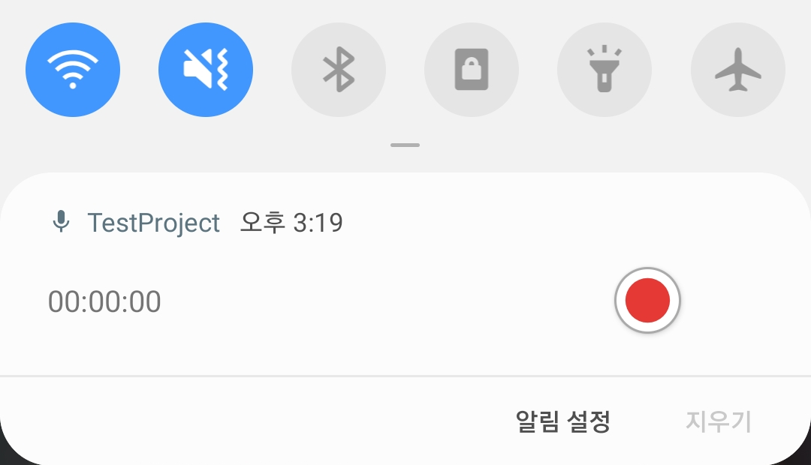
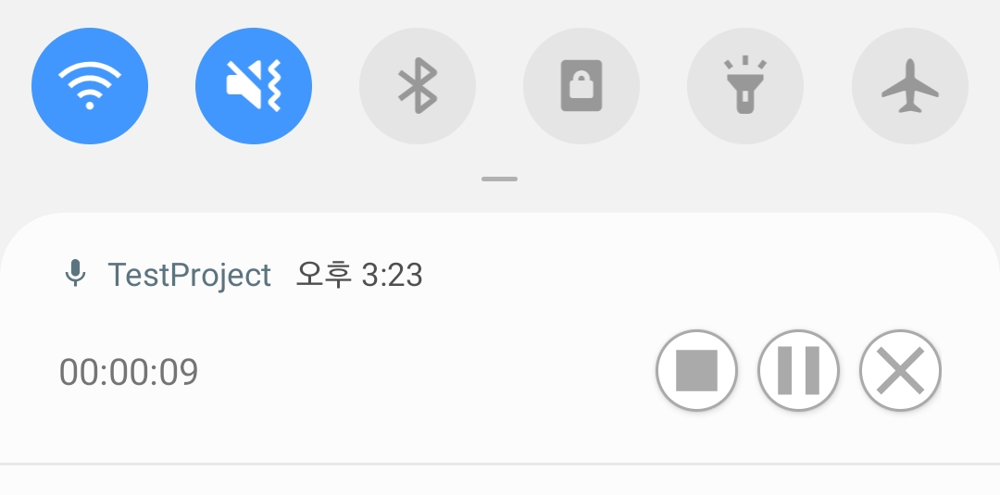

# ForegroundAudioRecorder
A library for audio recording at foreground.

 

## Index

[1. Examples](#example)

[2. Gradle Setup](#gradle-setup)

[3. How to use](#how-to-use)

 

## Example

 

## Gradle Setup

 

## How to use

 
