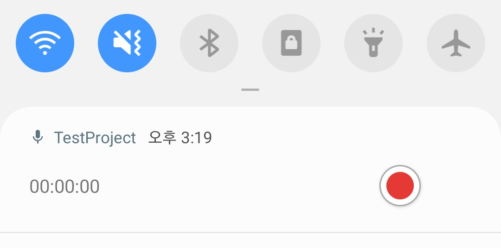

# ForegroundAudioRecorder
A library for audio recording at foreground.

[](https://jitpack.io/#HyunJinNo/ForegroundAudioRecorder)

<br/>

## Index

[1. Examples](#example)

[2. Gradle Setup](#gradle-setup)

[3. How to use](#how-to-use)

<br/>

## Example




<br/>

## Gradle Setup

To get this library into your build:

#### Step 1. Add the JitPack repository to your build file.

Add it in your settings.gradle at the end of repositories:

```gradle
repositories {
    ...
    maven { url 'https://jitpack.io' }
}
```

#### Step 2. Add the dependency.

Add it in your build.gradle (:app):

```gradle
dependencies {
    ...
    implementation 'com.github.HyunJinNo:ForegroundAudioRecorder:0.0:3'
}
```

<br/>

## How to use

#### Step 1. Add the following permissions to your AndroidManifest.xml.

```xml
<manifest xmlns:android="http://schemas.android.com/apk/res/android"
    xmlns:tools="http://schemas.android.com/tools">

    ...
    <uses-permission android:name="android.permission.FOREGROUND_SERVICE" />
    <uses-permission android:name="android.permission.POST_NOTIFICATIONS" />
    <uses-permission android:name="android.permission.RECORD_AUDIO" />
    <uses-permission android:name="android.permission.WRITE_EXTERNAL_STORAGE" />
    ...

</manifest>
```

#### Step 2. Request permissions before calling startService() method.

```kotlin
class MainActivity : AppCompatActivity() {
    private var permissions: Array<String> = arrayOf(
        Manifest.permission.RECORD_AUDIO,
        Manifest.permission.WRITE_EXTERNAL_STORAGE
    )

    companion object {
        private const val REQUEST_PERMISSIONS = 200
    }

    override fun onCreate(savedInstanceState: Bundle?) {
        ...
        requestPermissions(permissions, REQUEST_PERMISSIONS)
    }

    override fun onRequestPermissionsResult(
        requestCode: Int,
        permissions: Array<out String>,
        grantResults: IntArray
    ) {
        super.onRequestPermissionsResult(requestCode, permissions, grantResults)
        val flag = if (requestCode == REQUEST_PERMISSIONS) {
            grantResults.all { it == PackageManager.PERMISSION_GRANTED }
        } else {
            false
        }

        if (!flag) {
            Toast.makeText(applicationContext, "Permissions rejected.", Toast.LENGTH_SHORT).show()
            finish()
        }
    }
}
```

#### Step 3. After the permissions granted, call startService() method.

```kotlin
val intent = Intent(applicationContext, AudioService::class.java)
startService(intent)
```

#### Step 4. call stopService() method if you don't use the service anymore.

If you call stopService() method during audio recording, a recorded audio file is automatically created.

```kotlin
val intent = Intent(applicationContext, AudioService::class.java)
stopService(intent)
```

<br/>
